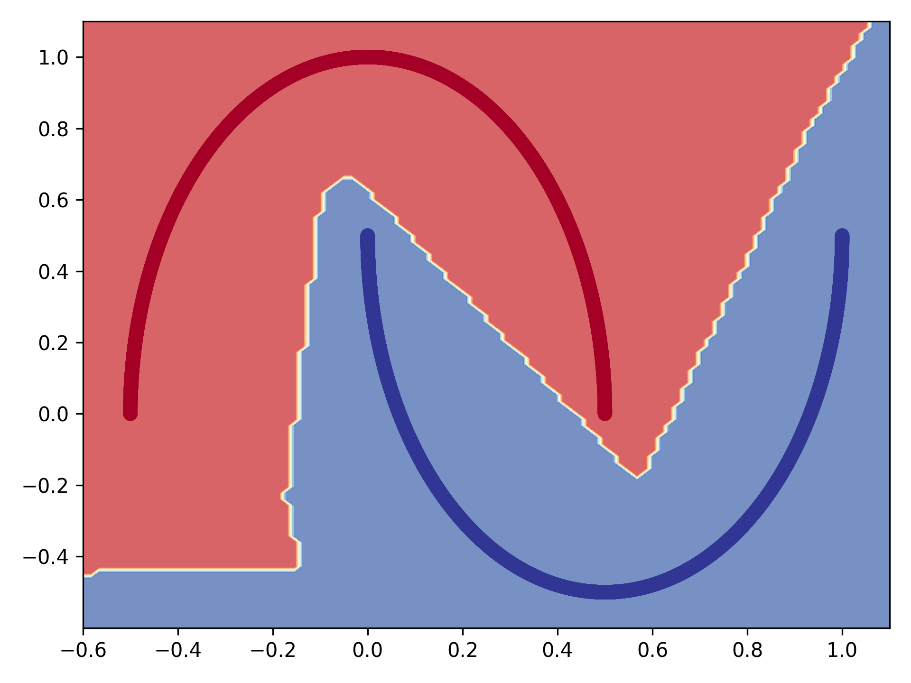
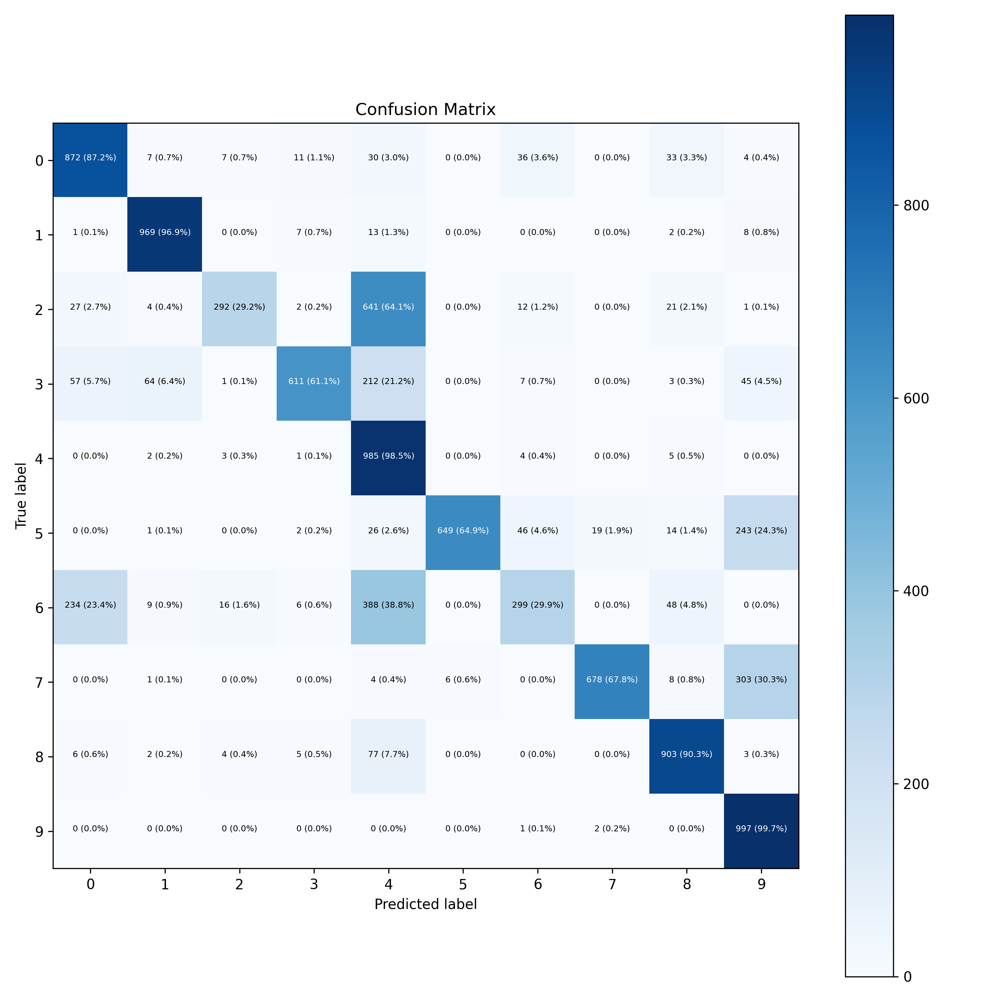

# 🤖 Applied Machine Learning Experiments: Make Moons & Fashion-MNIST

This repository contains two end-to-end machine learning experiments built with **TensorFlow/Keras**, focusing on the complete ML pipeline: data preprocessing, model training, evaluation, error analysis, and a production-oriented serving design.

The objective was not only to train models, but to understand their behavior and how they could be integrated into real systems.

---

## 📊 Datasets

### 🌙 Make Moons (Binary Classification)

- **8000 synthetic samples**
- **2 input features**
- **Non-linearly separable classes**

Used to validate model capacity and visualize non-linear decision boundaries.

### 👕 Fashion-MNIST (Multi-class Classification)

- **60,000 training images**
- **10,000 test images**
- **28×28 grayscale**
- **10 clothing categories**

Used to evaluate a dense neural network and perform confusion matrix analysis.

---

## ⚙️ Machine Learning Pipeline

**Data loading → Normalization → Train-test split → Model definition → Training → Evaluation → Error analysis**

For Fashion-MNIST:
- **One-hot encoding**
- **Learning rate scheduling**

---

## 🧠 Models

### 🌙 Make Moons Model

**Architecture**
- 5 hidden layers × 6 neurons
- ReLU activations
- Sigmoid output layer
- Binary cross-entropy loss
- Adam optimizer

**Test accuracy:** **100%**

⚠️ The dataset is simple, so the model likely **overfits**.  
This experiment was mainly used for **decision boundary visualization**.

---

### 👕 Fashion-MNIST Model

**Architecture**
- Flatten input (28×28)
- Dense layers with ReLU
- Softmax output (10 classes)
- Categorical cross-entropy
- SGD + learning rate scheduling

**Test accuracy:** **~88%**

---

## 📉 Error Analysis

A **confusion matrix** was generated for Fashion-MNIST.

🔎 **Key observations**
- Most errors occur between visually similar classes (**Shirt vs T-shirt**, **Sneaker vs Ankle boot**)
- Dense layers struggle with **spatial feature extraction**

➡️ A **CNN** would significantly improve performance.

---

## 🚀 Potential Improvements

- Replace dense model with a **CNN**
- Add **Dropout** for regularization
- Apply **data augmentation**
- Use **early stopping**
- Perform **hyperparameter tuning**
- Evaluate **precision, recall, F1-score**

---

## 🏭 Production Perspective

The models were designed with **deployment in mind**.

**Serving flow**
Client → REST API → preprocessing → model inference → response

**Production considerations**
- Export as **TensorFlow SavedModel**
- Use **batch inference**
- Apply **input validation**
- Monitor **latency**
- Detect **model drift**

The inference layer could be implemented as a **microservice** (FastAPI or Ktor) and integrated into a larger backend.

---

## 🖼️ Visualizations

### 🌙 Decision Boundary – Make Moons


### 👕 Confusion Matrix – Fashion-MNIST


---

## 🛠️ How to Run

### 1️⃣ Install dependencies
```bash
pip install -r requirements.txt
```
### 2️⃣ Run Make Moons experiment
```bash
python make_moons_model.py
```
This will:
- train the binary classification model
- print test accuracy
- generate the decision boundary plot
  
### 3️⃣ Run Fashion-MNIST experiment
```bash
python fashion_mnist_model.py
```
This will:
- train the multi-class model
- print test accuracy (~88%)
- generate the confusion matrix

## 📌 Key Takeaways
- Dense networks can model non-linear decision boundaries but are limited for image tasks
- Confusion matrix analysis reveals real model behavior beyond accuracy
- Model architecture must match the data modality (CNN for images)
- Applied ML requires thinking about serving, latency, and system integration, not only training
  
## 🔮 Future Work
- Implement a CNN for Fashion-MNIST
- Expose the trained model through an inference API
- Benchmark latency and throughput in a serving scenario
